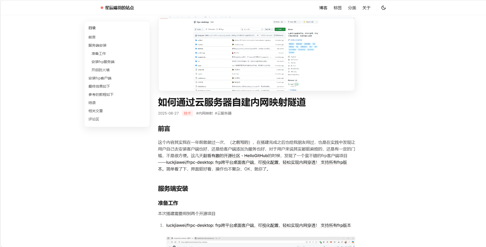

# Living Coral Blog（活珊瑚橘主题）

一个优雅、现代的中文静态博客模板，基于 Eleventy（11ty）与 Tailwind CSS 构建，开箱即用的目录（TOC）、深浅色主题、文章关联、评论（Giscus）、音乐播放器（APlayer）、滚动到顶与 AOS 动效。品牌主题色为 `#FC766A`（Living Coral 活珊瑚橘）。

---

## 📱 网站界面展示




---

## 特性

- **技术栈**：Eleventy（轻量静态站点生成）、Tailwind CSS（原子化样式）、PostCSS、AOS 动效
- **主题与外观**：明暗模式一键切换、品牌色注入、柔和阴影、系统字体优先
- **内容增强**：
  - 文章页自动目录（TOC）与移动端弹窗目录
  - 相关文章推荐与作者信息卡片
  - 支持分类与标签的聚合与详情页
- **互动功能**：Giscus 评论（可替换/移除），随主题自动切换
- **多媒体**：APlayer 音乐播放器与歌词同步（示例资源可替换）
- **分析与可选服务**：内置 Umami 脚本位（可自定义/移除）
- **部署友好**：完整的 GitHub Pages 支持，自动处理子目录部署路径问题

---

## 快速开始

1) 安装依赖

```bash
npm install
```

2) 本地开发（含 Tailwind 实时编译）

```bash
npm run dev
```

默认预览地址：`http://localhost:8080`

3) 生产构建

```bash
npm run build
```

产物将输出到 `_site/` 目录，可直接部署到任意静态托管平台。

**部署提示**：如需部署到 GitHub Pages 子目录，请参考下方的部署章节配置正确的环境变量。

脚本摘要（详见 `package.json`）：
- `dev`：并行启动 11ty 本地服务与 Tailwind 监听
- `build`：先构建 11ty，再产出压缩后的 CSS
- `css:watch` / `css:build`：从 `src/styles/tailwind.css` 输出到 `_site/assets/styles.css`

---

## 目录结构

```
src/
  _data/site.json          # 站点信息（标题、描述、作者、社交、品牌色、封面）
  _includes/               # 组件与布局（Nunjucks）
    components/header.njk  # 顶部导航（主题切换）
    components/footer.njk  # 页脚
    layouts/base.njk       # 基础布局（AOS、Umami、全局样式、回到顶部）
    layouts/post.njk       # 文章布局（TOC/相关文章/作者卡/评论）
  assets/                  # 静态资源（favicon、音乐与歌词等）
  scripts/                 # 前端脚本（TOC、评论、播放器、滚动）
  styles/tailwind.css      # Tailwind 入口
  index.njk                # 首页（简介、最新文章、音乐播放器）
  blog.njk                 # 博客列表页
  categories.njk / ...     # 分类/标签聚合与详情页
  404.njk / about.njk      # 404 与关于页
```

构建后的静态站点位于 `_site/`，路由结构与模板渲染一致。

---

## 写作与内容

- **文章**：将 Markdown 放入 `src/blog/*.md`
  - 支持 Front Matter：
    - `title`（必填）
    - `date`（ISO 或 `YYYY-MM-DD`）
    - `description`、`cover`
    - `category`（字符串）
    - `tags`（数组）
  - 默认使用 `layouts/post.njk`，自动生成 TOC、相关文章与作者卡片，并挂载评论区

- **分类与标签**：
  - 入口：`/categories/` 与 `/tags/`
  - 详情：`/categories/<分类>/` 与 `/tags/<标签>/`
  - 依赖文章 Front Matter 自动关联

- **站点信息**：编辑 `src/_data/site.json`
  - `title`、`description`、`author`（`name`、`bio`、`avatar`、`location`）
  - `social`（`github`、`email`、`bilibili` 等）
  - `themeColor`（品牌色，会注入到 CSS 变量 `--brand`）
  - `coverImage`（首页顶部大图）

---

## 外观与自定义

- Tailwind 配置：见 `tailwind.config.cjs`
  - `content: ./src/**/*.{njk,md,html,js}`
  - 自定义颜色：`livingCoral: #FC766A`
  - 插件：`@tailwindcss/typography`
- PostCSS：`postcss.config.cjs`（`tailwindcss` + `autoprefixer`）
- 暗黑模式：`darkMode: "class"`，依据 `localStorage.theme` 与系统偏好
- 全局样式输出：`_site/assets/styles.css`

小贴士：
- 修改品牌色：更新 `src/_data/site.json` 的 `themeColor`，`base.njk` 会同步注入到 `:root { --brand: ... }`
- 扩展样式：在 `src/styles/tailwind.css` 中添加 `@layer` 或自定义类，运行 `npm run dev` 实时生效

---

## 评论与音乐

- **Giscus 评论**（位于 `layouts/post.njk`，容器 `#giscus-container`）
  1. 在 Giscus 官网生成仓库与分类的配置
  2. 将 `data-repo`、`data-repo-id`、`data-category`、`data-category-id` 替换为你的值
  3. 若不需要评论，删除文章页"评论区"模块

- **APlayer 播放器**
  - 资源：`src/assets/APlayer.min_v1.10.1.*`
  - 播放列表/歌词：`src/assets/musics/` 与 `src/scripts/aplayer.js`
  - 构建后可从 `_site/assets/` 访问

---

## 🗺️ 站点地图功能

本博客已集成完整的站点地图系统，支持自动生成 XML 站点地图和 robots.txt 文件，提升搜索引擎优化（SEO）效果。

### ✨ 主要特性

- **自动生成**：每次构建时自动更新站点地图
- **智能 URL 管理**：包含所有博客文章、分类页面和标签页面
- **SEO 优化**：设置合理的更新频率和优先级
- **多环境支持**：支持本地开发、测试环境和生产环境的不同配置

### 🔧 使用方法

#### 1. 自动配置（推荐）

站点地图会自动从以下优先级获取 baseUrl：

1. **环境变量** `SITE_BASE_URL` (最高优先级)
2. **站点配置** `src/_data/site.json` 中的 `baseUrl` 字段
3. **默认值** `https://www.antares.xin` (最低优先级)

#### 2. 环境变量配置

```bash
# Windows PowerShell
$env:SITE_BASE_URL="https://your-domain.com"; npm run build

# Linux/macOS
SITE_BASE_URL=https://your-domain.com npm run build
```

#### 3. 站点配置文件

编辑 `src/_data/site.json`：

```json
{
  "title": "星辰曦羽的站点",
  "baseUrl": "https://www.antares.xin",
  // ... 其他配置
}
```

#### 4. GitHub Actions 部署

在 `.github/workflows/GitHub-Pages.yml` 中已配置：

```yaml
env:
  SITE_BASE_URL: https://aesculapius11.github.io
```

### 📁 生成的文件

- `_site/sitemap.xml` - 完整的 XML 站点地图
- `_site/robots.txt` - 搜索引擎爬虫配置文件

### 🌐 访问地址

部署后可通过以下地址访问：

- **站点地图**：`https://your-domain.com/sitemap.xml`
- **爬虫配置**：`https://your-domain.com/robots.txt`

### 📈 SEO 优化设置

站点地图已针对不同类型的内容设置了优化的参数：

- **主页**：优先级 1.0，每日更新
- **博客列表**：优先级 0.9，每日更新  
- **关于页面**：优先级 0.8，每月更新
- **分类/标签页**：优先级 0.7，每周更新
- **博客文章**：优先级 0.6，每月更新
- **分类详情**：优先级 0.5，每周更新
- **标签详情**：优先级 0.5，每周更新

---

## 部署

构建产物为纯静态文件，推荐：

- GitHub Pages：CI 产出 `_site/` 并发布到 `gh-pages` 或 Pages 目录
- Vercel：Framework 选 Other；Build Command `npm run build`；Output `_site`
- Cloudflare Pages：Build `npm run build`；Output Directory `_site`

### GitHub Pages 部署（推荐）

本项目已配置完整的 GitHub Actions 工作流，支持子目录部署（如 `username.github.io/repository-name/`），并自动生成站点地图。

#### 自动部署配置

1. **仓库设置**：
   - 确保仓库名为 `username.github.io`（用户页面）或任意名称（项目页面）
   - 在 Settings > Pages 中启用 GitHub Pages

2. **工作流文件**：
   - 已包含 `.github/workflows/GitHub-Pages.yml`
   - 自动设置正确的 base URL 环境变量
   - 支持缓存和优化的构建流程

3. **路径配置**：
   - 项目已配置 Eleventy 的 `pathPrefix` 支持
   - 所有静态资源和链接都会自动添加正确的前缀
   - 支持子目录部署，不会出现 404 错误
   - 站点地图会自动使用正确的 baseUrl 和路径前缀

#### 手动部署步骤

如果使用手动部署，需要设置环境变量：

```bash
# 设置正确的 base URL（根据你的部署路径调整）
export ELEVENTY_BASE_URL="/your-repo-name/"

# 构建项目
npm run build
```

#### 示例 GitHub Actions 配置

```yaml
name: GitHub Pages
on:
  push:
    branches: [ master ]
permissions:
  contents: read
  pages: write
  id-token: write
jobs:
  build:
    runs-on: ubuntu-latest
    env:
      ELEVENTY_BASE_URL: /Living-Coral/  # 根据你的仓库设置调整
    steps:
      - name: Checkout
        uses: actions/checkout@v4
        
      - name: Setup Node.js
        uses: actions/setup-node@v4
        with:
          node-version: 20
          cache: 'npm'
          
      - name: Install dependencies
        run: npm ci
        
      - name: Build site
        run: npm run build
          
      - name: Upload artifact
        uses: actions/upload-pages-artifact@v3
        with:
          path: _site
          
  deploy:
    needs: build
    runs-on: ubuntu-latest
    environment:
      name: github-pages
      url: ${{ steps.deployment.outputs.page_url }}
    steps:
      - name: Deploy to GitHub Pages
        id: deployment
        uses: actions/deploy-pages@v4
```

**重要提示**：将 `ELEVENTY_BASE_URL` 中的 `/Living-Coral/` 替换为你的实际仓库名称。站点地图会自动使用正确的 baseUrl 和路径前缀。

---

## 常见问题（FAQ）

- 本地端口是多少？
  - 默认 `8080`，如被占用请查看 Eleventy 控制台输出
- 样式没有更新？
  - 确保在运行 `npm run dev`（Tailwind 处于 watch）
- 资源应放在哪？
  - 页面中使用 `/assets/...` 路径，源文件应位于 `src/assets`，构建后会复制到 `_site/assets`
- 部署到 GitHub Pages 后出现 404 错误？
  - 确保设置了正确的 `ELEVENTY_BASE_URL` 环境变量
  - 检查 `.github/workflows/GitHub-Pages.yml` 中的路径配置
  - 所有静态资源和链接都会自动添加正确的前缀
- 如何修改部署路径？
  - 更新 `.github/workflows/GitHub-Pages.yml` 中的 `ELEVENTY_BASE_URL` 值
  - 本地构建时设置环境变量：`export ELEVENTY_BASE_URL="/your-path/"`
- 站点地图没有正确生成？
  - 确保运行了 `npm run build` 命令
  - 检查 `src/_data/site.json` 中是否设置了 `baseUrl`
  - 验证环境变量 `SITE_BASE_URL` 是否正确设置
- 如何自定义站点地图的更新频率和优先级？
  - 编辑 `.eleventy.js` 文件中的 `sitemap` 集合配置
  - 可以调整不同类型页面的 `changefreq` 和 `priority` 值

---

## 许可证

本项目采用 MIT License 开源协议。详见仓库根目录的 `LICENSE` 文件。


